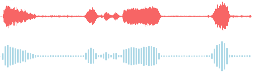
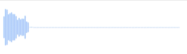

# **react-audio-visualize**
An audio visualizer for React. Provides separate components to visualize both live audio and audio blobs.

## Installation
```sh
npm install react-audio-visualize
```

## **AudioVisualizer** Component ([Example](https://stackblitz.com/edit/stackblitz-starters-kjpu5q?file=src%2FApp.tsx))



```js
import React, { useState, useRef } from 'react';
import { AudioVisualizer } from 'react-audio-visualize';

const Visualizer = () => {
  const [blob, setBlob] = useState<Blob>();
  const visualizerRef = useRef<HTMLCanvasElement>(null)

  // set blob somewhere in code

  return (
    <div>
      {blob && (
        <AudioVisualizer
          ref={visualizerRef}
          blob={blob}
          width={500}
          height={75}
          barWidth={1}
          gap={0}
          barColor={'#f76565'}
        />
      )}
    </div>
  )
}

```

| Props  | Description | Default | Optional |
| :------------ |:--------------- |:--------------- | :--------------- |
| **`blob`**  | Audio blob to visualize | N/A | No |
| **`width`** | Width of the visualizer | N/A | No |
| **`height`** | Height of the visualizer | N/A | No |
| **`barWidth`** | Width of each individual bar in the visualization | `2` | Yes |
| **`gap`** |  Gap between each bar in the visualization | `1` | Yes |
| **`backgroundColor`** |  BackgroundColor for the visualization | `transparent` | Yes |
| **`barColor`** |  Color for the bars that have not yet been played | `"rgb(184, 184, 184)""` | Yes |
| **`barPlayedColor`** |  Color for the bars that have been played | `"rgb(160, 198, 255)""` | Yes |
| **`currentTime`** |  Current time stamp till which the audio blob has been played. Visualized bars that fall before the current time will have `barPlayerColor`, while that ones that fall after will have `barColor` | N/A | Yes |
| **`style`** |  Custom styles that can be passed to the visualization canvas | N/A | Yes |
| **`ref`** |  A `ForwardedRef` for the `HTMLCanvasElement` | N/A | Yes |

---

## **LiveAudioVisualizer** Component ([Example](https://stackblitz.com/edit/stackblitz-starters-kjpu5q?file=src%2FApp.tsx))



```js
import React, { useState } from 'react';
import { LiveAudioVisualizer } from 'react-audio-visualize';

const Visualizer = () => {
  const [mediaRecorder, setMediaRecorder] = useState<MediaRecorder>();

  // set media recorder somewhere in code

  return (
    <div>
      {mediaRecorder && (
        <LiveAudioVisualizer
          mediaRecorder={mediaRecorder}
          width={200}
          height={75}
        />
      )}
    </div>
  )
}

```

| Props  | Description | Default | Optional |
| :------------ |:--------------- |:--------------- | :--------------- |
| **`mediaRecorder`**  | Media recorder who's stream needs to visualized | N/A | No |
| **`width`** | Width of the visualizer | `100%` | Yes |
| **`height`** | Height of the visualizer | `100%` | Yes |
| **`barWidth`** | Width of each individual bar in the visualization | `2` | Yes |
| **`gap`** |  Gap between each bar in the visualization | `1` | Yes |
| **`backgroundColor`** |  BackgroundColor for the visualization | `transparent` | Yes |
| **`barColor`** |  Color for the bars that have not yet been played | `"rgb(160, 198, 255)"` | Yes |
| **`fftSize`** |  An unsigned integer, representing the window size of the FFT, given in number of samples. For more [details](https://developer.mozilla.org/en-US/docs/Web/API/AnalyserNode/fftSize) | `1024` | Yes |
| **`maxDecibels`** |  A double, representing the maximum decibel value for scaling the FFT analysis data. For more [details](https://developer.mozilla.org/en-US/docs/Web/API/AnalyserNode/maxDecibels) | `-10` | Yes |
| **`minDecibels`** |  A double, representing the minimum decibel value for scaling the FFT analysis data, where 0 dB is the loudest possible sound. For more [details](https://developer.mozilla.org/en-US/docs/Web/API/AnalyserNode/minDecibels) | `-90` | Yes |
| **`smoothingTimeConstant`** |  A double within the range 0 to 1 (0 meaning no time averaging). For more [details](https://developer.mozilla.org/en-US/docs/Web/API/AnalyserNode/smoothingTimeConstant) | `0.4` | Yes |


